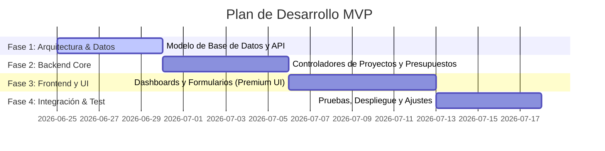

# MVP Plan: Seguimiento de Proyectos de Cooperativa

Este documento detalla el plan de desarrollo para el Producto Mínimo Viable (MVP) de la plataforma de seguimiento de proyectos.

## 📅 Resumen de Fases y Cronograma

El desarrollo del MVP se dividirá en 4 fases principales durante un periodo estimado de 4 semanas:

---

## 🔍 Detalle de Fases

### Fase 1: Arquitectura y Modelado de Datos
*   **Objetivo**: Establecer la estructura de base de datos y configurar el entorno del servidor.
*   **Entregables**:
    *   Base de datos configurada e inicializada (tablas de proyectos, usuarios, hitos, transacciones).
    *   Script de migración y seed con datos de prueba realistas.
    *   Configuración inicial del backend (API endpoints básicos de salud y autenticación).

### Fase 2: API & Lógica del Servidor (Backend Core)
*   **Objetivo**: Construir los servicios RESTful para soportar las operaciones del negocio.
*   **Entregables**:
    *   CRUD de Proyectos (`/api/projects`).
    *   Mantenimiento de Hitos (`/api/projects/:id/milestones`).
    *   Control de Presupuestos y Gastos (`/api/projects/:id/transactions`).
    *   Autenticación de usuarios y middleware de roles.

### Fase 3: Interfaz de Usuario (Frontend Premium)
*   **Objetivo**: Crear una experiencia web interactiva, moderna y estéticamente sobresaliente utilizando Vanilla HTML/CSS/JS.
*   **Entregables**:
    *   **Dashboard Principal**: Tarjetas resumen de KPIs (Proyectos Activos, Presupuesto Total vs Ejecutado, Hitos en Riesgo) y gráficos dinámicos de ejecución.
    *   **Vista de Detalle del Proyecto**: Línea de tiempo interactiva de hitos, desglose de gastos y listado de actividades.
    *   **Formularios de Creación/Edición**: Modales pulidos y dinámicos para agregar proyectos o registrar transacciones.

### Fase 4: Integración, Pruebas y Lanzamiento
*   **Objetivo**: Conectar el frontend con el backend, asegurar la calidad y preparar la puesta en marcha.
*   **Entregables**:
    *   Conexión completa API-UI con manejo de estados de carga y errores elegantes.
    *   Pruebas unitarias y de integración de flujos críticos (registro de gastos y cambio de estado de hitos).
    *   Despliegue inicial en entorno de pruebas (Staging).

---

## 🏆 Criterios de Aceptación del MVP
1.  Un usuario administrador puede crear un proyecto con un presupuesto asignado.
2.  Un líder de proyecto puede registrar un gasto y el dashboard actualiza automáticamente el porcentaje de ejecución presupuestaria.
3.  El sistema muestra visualmente si un proyecto está al día, retrasado o en riesgo basándose en el estado de sus hitos.
4.  La interfaz es completamente responsiva y funciona sin problemas en dispositivos móviles y de escritorio.
