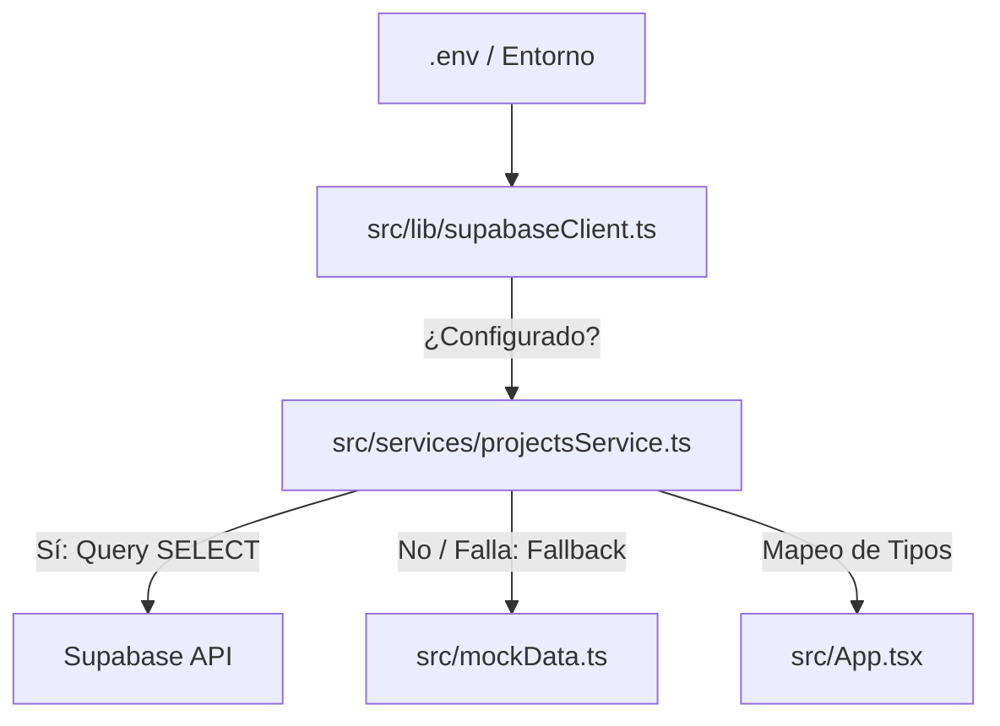

# Integración de Supabase y Mecanismos de Fallback

Este documento describe la arquitectura de la integración física con Supabase PostgreSQL y el comportamiento del sistema de tolerancia a fallos (fallback) desarrollado en la Fase 3.

---

## 🔌 Arquitectura de la Conexión

La comunicación con la base de datos se desacopla del árbol de componentes React y se centraliza en dos módulos:



1.  **Cliente Centralizado (`supabaseClient.ts`)**: Encargado de instanciar el SDK de Supabase. Si las variables `VITE_SUPABASE_URL` y `VITE_SUPABASE_ANON_KEY` no están presentes en el entorno, inicializa el cliente como `null` y exporta la bandera `isSupabaseConfigured = false`.
2.  **Capa de Servicios (`projectsService.ts`)**: Concentra las peticiones de lectura a las tablas de base de datos. Si `isSupabaseConfigured` es falso, retorna directamente los datos mock locales correspondientes para evitar esperas o errores de red.

---

## 🛡️ Tolerancia a Fallos y Fallback Automático

Cada función de servicio está envuelta en un bloque `try-catch` para aislar cualquier error transaccional o de conectividad:

1.  **Sin Variables de Entorno**: La app detecta la falta de claves al arrancar, emite un aviso controlado en la consola del navegador y carga los datos de `mockData.ts`.
2.  **Base de Datos Desconectada o Error de Red**: Si las credenciales son válidas pero la red falla, la base de datos está caída o el API retorna un error en la consulta, la excepción es atrapada por el bloque `catch` del servicio, el cual escribe un `console.warn` y retorna los datos mock correspondientes, manteniendo la interfaz visual activa y funcional.

---

## 🔀 Mapeo Relacional de Columnas y Tipos

La base de datos relacional (Fase 2) y el frontend (Fase 1) tienen diferencias estructurales que el servicio resuelve mediante funciones de mapeo (`mapProject`, `mapAdvance`, etc.):

### 1. Reemplazo de Propiedades Financieras
Siguiendo las restricciones obligatorias de gobernanza de esfuerzo (horas en vez de presupuestos):
*   Se eliminó la propiedad `budget` de la interfaz TypeScript.
*   En el servicio de lectura, la columna de la base de datos `estimated_effort_hours` se mapea a la propiedad `estimatedEffortHours` en el frontend, la cual es consumida por los componentes para mostrar el esfuerzo total en horas.

### 2. Conversión de Relaciones y Joins
Para evitar que el frontend deba realizar múltiples consultas para obtener nombres legibles de usuarios, el servicio ejecuta joins relacionales utilizando sintaxis de Supabase:
*   **Líderes y Asignados (Desambiguación de Relaciones)**: Dado que existen múltiples llaves foráneas apuntando desde una misma tabla (como `projects` o `project_risks`) hacia `profiles` (`created_by`, `updated_by`, `assignee_id`/`leader_id`), se utiliza desambiguación explícita mediante el nombre de la llave foránea correspondiente en la sintaxis de PostgREST (ej: `profiles!projects_leader_id_fkey(first_name, last_name)`). Esto previene el error de ambigüedad `PGRST201` y asegura la correcta resolución del join en Supabase.
*   **Asistentes de Reuniones**: Se une la relación intermedia `meeting_attendees` con `profiles` para retornar un array de textos con los nombres de todos los participantes.
*   **Evidencias Adjuntas**: Se consulta la relación lateral de `project_evidence` y se asigna el primer nombre de archivo disponible como soporte del avance o compromiso.

### 3. Normalización de Identificadores (UUID vs. Numbers)
*   Se implementó el alias `EntityId = string | number` en `src/types.ts`.
*   Para evitar que la comparación estricta de JavaScript (`===`) falle al mezclar IDs numéricos del mock (`1`, `2`) y UUIDs de Supabase (`'22222222-...'`), se normalizaron las comparaciones de la aplicación usando:
    ```typescript
    String(id_A) === String(id_B)
    ```
*   Se agregó un mapeo de ID en `src/components/ProjectDetail.tsx` que traduce los UUIDs de la base de datos seed a sus equivalentes lógicos `1`, `2`, `3`, `4` exclusivamente para habilitar los textos condicionales del diagnóstico BPMO maquetados en la Fase 1.
